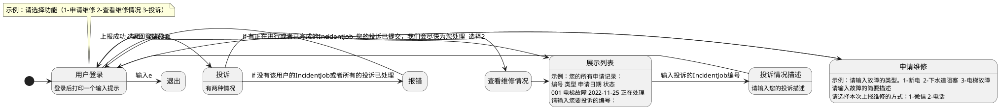
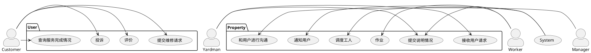
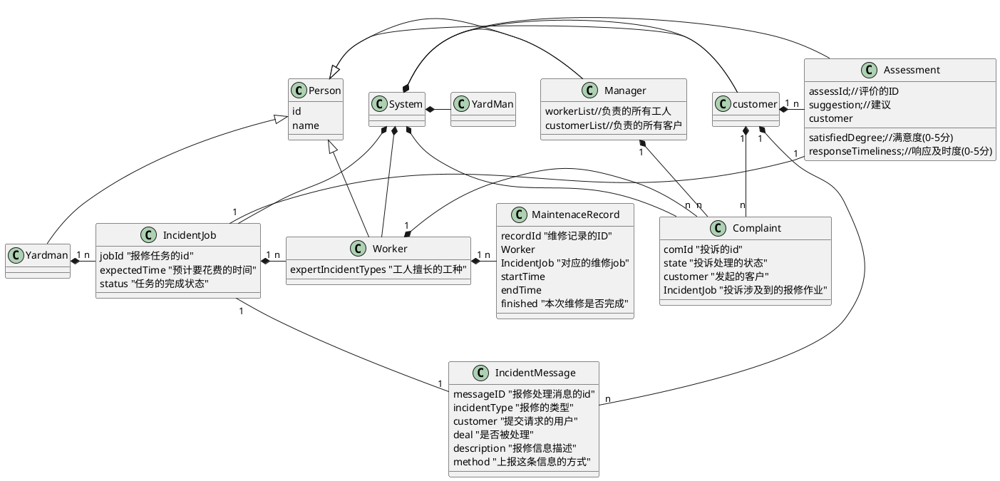
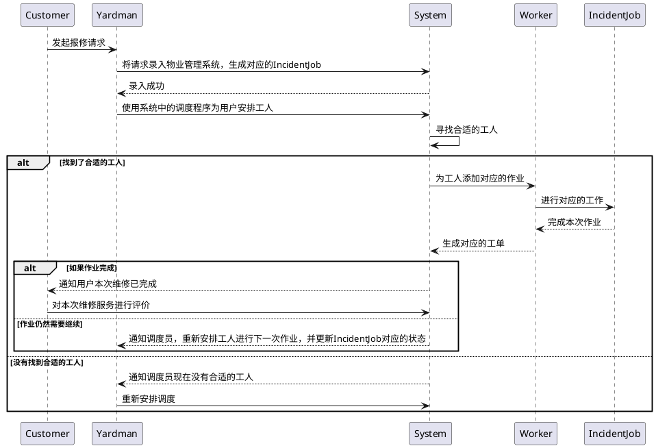
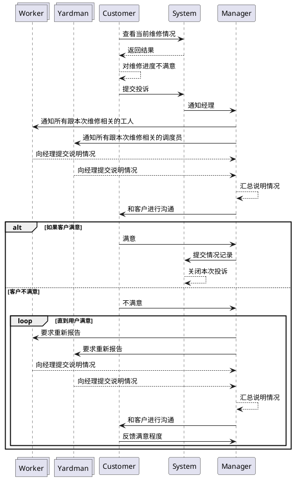

# 结构设计

## 模块划分

由于本项目不要求多并发处理，因此采用单进程的模式进行开发，不去做多进程的并发处理（那样会显著的加大任务的难度）
总体上的设计分为五个模块：

1. Customer。首先需要输入用户的用户名，然后在成功登录后，首先调用一个**onLogin**方法，这个方法首先查看自己的消息信箱（比如，用户上报的维修任务完成、调度员发现
   系统中有新的待分配维修任务、工人发现自己有新的被分配的维修任务、客户经理发现自己收到了客户的投诉）。Customer模块主要有三个功能：1.申请维修  2. 查看自己维修订单的
   处理进度 3. 对正在进行或者已完成的维修申请进行投诉
2. Yardman（调度员）。同上，首先输入自己的用户名，成功登录后，也会率先调用一个**onLogin**方法，查看自己的消息信箱（消息信箱中包含被投诉的信息），如果有未处理的维修请求，则马上对这些请求进行
   处理。同时调度员还能够查看所有工人当前的工作状态等信息。并且，调度员必须能够了解指定的维修作业调度过程是什么情况，调度的记录（比如什么时候，安排了谁去做这项工作）、作业产生的工单（搜索所有的跟这个
   作业ID挂钩的工人对这项作业产生的所有工单）
3. Worker。同上，首先输入自己的用户名，成功登录后，调用**onLogin**方法，查看自己的消息信箱，信息分为被投诉信息和待完成的任务两项，并优先处理这两个内容。工人负责的任务就比较简单，只要实现work这个
   方法即可。当然也要注意一点，就是登录工人的账号以后，确认开始作业，但是作业不可能一瞬间完成，这个时候切换到其他的用户，需要保留上一次工人作业的进度。这里比较合理的做法是，给工单也添加一个是否完成的标记，
   加入到工人的信箱当中，当登录的时候，如果有上一个没有完成的工单，那么就优先处理这个内容。否则就正常登录
4. Manager。输入用户名，成功登录后，调用**onLogin**方法，查看自己的消息信箱中是否有待处理的投诉信息。如果有，就通知所有跟这次投诉相关的工人和调度员，在他们的消息信箱中加入投诉信息，然后要求他们
   提交情况说明，并对情况说明进行统计，当下次登录发现情况说明数量到达预期的数字后，就给客户的消息信箱中发送投诉处理完毕的消息，然后等待客户的满意度调查。如果客户满意，就关闭这次投诉
5. System(登录账号admin，超级管理员)。系统类主要负责缓存上面提到的所有数据结构，比如所有的客户列表、调度员列表等等。同时具备一些个人用户不具备的特殊方法，比如调度员需要的自动调度方法，将客户提交的
   请求先缓存到系统的缓存队列中，自动给每个人的信箱发消息等等。

## 工作流模式

一种比较简单易懂的小型项目的开发流程就是工作流模式。瞄准其中一个模块，从它最开始的状态出发，设想这个状态可能会出现的所有事件，进入到这些事件对应的下一个状态集合，然后再由这些状态集合出发，不断扩展，直到
遇到最后结束的状态集合。然后使用代码构建这些状态对应的场景，从一个最简单的基本应用开始，不断地考虑过程中会出现的问题从而改进这个应用，直至实现所有的需求。

### Customer工作流



### **Yardman工作流**

```plantuml
@startuml

[*] -> 消息信箱
note top of 消息信箱: 这个时候已经默认登录了
消息信箱 -> 显示未处理的IncidentJob: 如果有未处理的维修请求

消息信箱 -> 提交情况说明: 如果有收到用户的投诉
提交情况说明 -> 消息信箱: 提交成功
消息信箱 -> 功能选择: 如果信箱里没有任何消息

功能选择: 请选择功能（1-调度任务 2-查看所有工人的状态 3-查看IncidentJob对应的工单 e-退出)
功能选择 -> 显示未处理的IncidentJob: 选择1
显示未处理的IncidentJob : 示例： 编号 类型 上报用户 上报时间 状态
显示未处理的IncidentJob -> 安排调度: 如果有
显示未处理的IncidentJob -> 消息信箱: 显示“当前没有未处理的维修请求”
安排调度: 示例: 请输入要调度的作业编号

安排调度 -> 消息信箱: 显示“调度成功”
安排调度 -> 显示工人列表: 打印“调度失败，当前没有合适的工人安排,请稍后再试”

功能选择 -> 显示工人列表: 选择2
显示工人列表: 示例：编号 姓名 擅长工种 是否忙碌
显示工人列表 -> 消息信箱

功能选择 -> 查看工单 : 选择3
查看工单 -> 

@enduml
```



**类设计图**



**用户发起报修请求**



**用户投诉**


